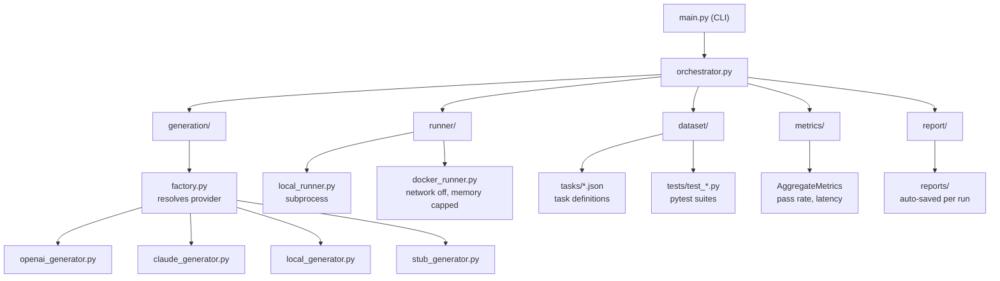

# AI Code Arbiter

**Evaluates AI-generated code by executing it, not simply trusting it.**

Stop trusting AI-generated code.

This system **executes it.**

It sends coding tasks to AI models, runs the generated code in a sandbox, and verifies correctness using real test suites.

No guessing. No vibes. Only execution-based truth.

It doesn't just tell you what failed, it tells you why it failed and what that reveals about the model.

## Why this matters

Most AI tools evaluate models based on outputs that *look correct*.

This system evaluates models based on whether their code actually works.

That difference exposes real weaknesses:

- Models that pass standard problems but fail on reasoning tasks
- Models that produce correct logic but break on edge cases
- Models that detect patterns but fail to propagate effects across related data

Example:
A model can detect suspicious transactions —
but fail to flag all transactions within the same time window.

This is not a syntax issue. It's a reasoning failure.

## Key Features

- Execution-based validation (not prompt evaluation)
- Docker sandbox (safe, isolated code execution)
- Failure classification (logic, edge case, temporal reasoning)
- Multi-run support (detects non-determinism)
- Structured reporting (what failed, why, and what it means)

---

## Architecture



---

## Quickstart

```bash
pip install -r requirements.txt
```

Create `.env` in this directory:

```env
OPENAI_API_KEY=sk-...
OPENAI_MODEL=gpt-4o-mini
```

Run:

```bash
python main.py run --provider openai
python main.py report --provider openai
```

---

## CLI

```bash
# Run all tasks, print pass/fail per task
python main.py run --provider openai

# Full benchmark report (saved to reports/ automatically)
python main.py report --provider openai

# Run inside Docker sandbox
python main.py run --provider openai --docker

# Inspect one task: see generated code + full pytest output
python main.py inspect fix_binary_search --provider openai

# Run each task N times (non-determinism analysis)
python main.py multi --provider openai --runs 5

# No API key needed (uses hardcoded stub solutions)
python main.py run --provider stub
```

---

## Providers

| Flag | Model source |
|------|-------------|
| `openai` | OpenAI API (`OPENAI_API_KEY`, `OPENAI_MODEL`) |
| `claude` | Anthropic API (`ANTHROPIC_API_KEY`, `CLAUDE_MODEL`) |
| `local` | LM Studio at `LOCAL_MODEL_URL` (OpenAI-compatible) |
| `stub` | Hardcoded solutions — no API key, for testing the pipeline |

---

## Model comparison — `gpt-4o-mini` vs `gpt-5.4-mini`

Same 19 tasks, same test suite, same sandbox.

### Summary

| Metric | gpt-4o-mini | gpt-5.4-mini |
|---|---|---|
| Pass rate | 89.5% (17/19) | 89.5% (17/19) |
| Avg latency | 2367ms | 1493ms |
| Syntax errors | 0 | 1 (non-deterministic) |
| Logic errors | 2 | 1 |

### Per-task breakdown

| Task | gpt-4o-mini | gpt-5.4-mini |
|---|---|---|
| fibonacci_iterative | PASS | PASS |
| two_sum | PASS | PASS |
| lru_cache | PASS | FAIL (syntax_error — flaky, passes on re-run) |
| binary_search | PASS | PASS |
| valid_parentheses | PASS | PASS |
| max_subarray | PASS | PASS |
| is_palindrome | PASS | PASS |
| is_prime | PASS | PASS |
| flatten_list | PASS | PASS |
| word_frequency | PASS | PASS |
| group_anagrams | PASS | PASS |
| binary_search_count | PASS | PASS |
| flatten_deep | PASS | PASS |
| fix_two_sum | PASS | PASS |
| fix_binary_search | PASS | PASS |
| merge_sorted_arrays | PASS | PASS |
| count_vowels | PASS | PASS |
| detect_suspicious_transactions | FAIL (temporal_reasoning_error) | PASS |
| two_sum_all_pairs | FAIL (edge_case_error) | FAIL (edge_case_error) |

### Failure analysis

| Task | gpt-4o-mini | gpt-5.4-mini |
|---|---|---|
| `detect_suspicious_transactions` | Flags the triggering transaction but misses earlier ones in the same time window — temporal reasoning failure | Passes |
| `lru_cache` | Passes | Generated invalid Python syntax on this run. Passes cleanly on re-run — non-deterministic, not a real gap |
| `two_sum_all_pairs` | Returns wrong result for empty input | Returns wrong result for empty input |

### Key insight

Same headline score, but the failures are different. `gpt-5.4-mini` solved the temporal reasoning task that `gpt-4o-mini` couldn't, and runs 37% faster. The only shared failure — `two_sum_all_pairs` empty input — is consistent across both, pointing to a systematic edge case blind spot that neither model handles reliably.

---

## Adding a task

1. Add `dataset/tasks/your_task.json`:

```json
{
  "task_id": "your_task",
  "description": "Write a function that ...",
  "language": "python",
  "test_file": "tests/test_your_task.py",
  "timeout": 10,
  "task_type": "implement"
}
```

2. Add `dataset/tests/test_your_task.py`:

```python
from solution import your_function

def test_basic():
    assert your_function(...) == ...
```

The engine picks it up automatically.

---

## Future work

Planned or exploratory directions:

- **Agentic coding evaluation** — multi-turn sessions, tool use (search, terminal, edits), and end-to-end “agent completes a ticket” runs with execution-based checks at each step.
- **Real-world problem solving** — tasks with partial specs, legacy codebases, debugging scenarios, and integration-style tests that mirror how software is actually built and maintained.
- **Broader task coverage** — security-sensitive code, performance constraints, concurrency, and cross-language or polyglot pipelines.
- **Richer sandboxes** — reproducible dependency graphs, resource limits tuned per task, and optional network or service mocks for API-heavy problems.
- **Comparative and longitudinal studies** — model/version matrices, regression tracking across releases, and calibration against human baselines where available.
