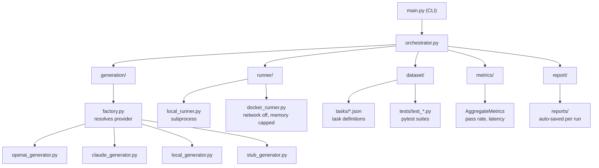

# AI Code Arbiter

**Evaluates AI-generated code by executing it, not simply trusting it.**

Stop trusting AI-generated code.

This system **executes it.**

It sends coding tasks to AI models, runs the generated code in a sandbox, and verifies correctness using real test suites.

No guessing. No vibes. Only execution-based truth.

It doesn't just tell you what failed, it tells you why it failed and what that reveals about the model.

## Why this matters

Most AI tools evaluate models based on outputs that *look correct*.

This system evaluates models based on whether their code actually works.

That difference exposes real weaknesses:

- Models that pass standard problems but fail on reasoning tasks
- Models that produce correct logic but break on edge cases
- Models that detect patterns but fail to propagate effects across related data

Example:
A model can detect suspicious transactions —
but fail to flag all transactions within the same time window.

This is not a syntax issue. It's a reasoning failure.

## Key Features

- Execution-based validation (not prompt evaluation)
- Docker sandbox (safe, isolated code execution)
- Failure classification (logic, edge case, temporal reasoning)
- Multi-run support (detects non-determinism)
- Structured reporting (what failed, why, and what it means)

---

## Architecture



---

## Quickstart

```bash
pip install -r requirements.txt
```

Create `.env` in this directory:

```env
OPENAI_API_KEY=sk-...
OPENAI_MODEL=gpt-4o-mini
```

Run:

```bash
python main.py run --provider openai
python main.py report --provider openai
```

---

## CLI

```bash
# Run all tasks, print pass/fail per task
python main.py run --provider openai

# Full benchmark report (saved to reports/ automatically)
python main.py report --provider openai

# Run inside Docker sandbox
python main.py run --provider openai --docker

# Inspect one task: see generated code + full pytest output
python main.py inspect fix_binary_search --provider openai

# Run each task N times (non-determinism analysis)
python main.py multi --provider openai --runs 5

# No API key needed (uses hardcoded stub solutions)
python main.py run --provider stub
```

---

## Providers

| Flag | Model source |
|------|-------------|
| `openai` | OpenAI API (`OPENAI_API_KEY`, `OPENAI_MODEL`) |
| `claude` | Anthropic API (`ANTHROPIC_API_KEY`, `CLAUDE_MODEL`) |
| `local` | LM Studio at `LOCAL_MODEL_URL` (OpenAI-compatible) |
| `stub` | Hardcoded solutions — no API key, for testing the pipeline |

---

## Example: Real model failure analysis

Report excerpt (OpenAI `gpt-4o-mini`):

```
============================================================
  BENCHMARK REPORT
============================================================

  SECTION 1 - SUMMARY
------------------------------------------------------------

  Model:        gpt-4o-mini
  Provider:     openai
  Tasks run:    19
  Passed:       17/19
  Pass rate:    89.5%
  Avg latency:  2367ms
  Generated:    2026-03-21 14:16

  SECTION 2 - FAILURE BREAKDOWN
------------------------------------------------------------

  Failures (2):
    logic_error: 2

  Refined:
    edge_case_error: 1
    temporal_reasoning_error: 1

  SECTION 3 - TASK-LEVEL FAILURES
------------------------------------------------------------

  detect_suspicious_transactions:
    failure_type:   temporal_reasoning_error
    raw_type:       logic_error
    tests_passed:   3
    tests_failed:   5
    pattern:        Fails to reason correctly across time windows
    failing_tests:
      - test_no_suspicious_only_two
      - test_only_suspicious_sender_flagged
      - test_sliding_window_not_just_first_60s
      - test_multiple_windows_same_sender

  two_sum_all_pairs:
    failure_type:   edge_case_error
    raw_type:       logic_error
    tests_passed:   9
    tests_failed:   1
    pattern:        Incorrect handling of empty or no-result cases
    failing_tests:
      - test_no_pairs

  SECTION 4 - KEY INSIGHTS
------------------------------------------------------------

  [detect_suspicious_transactions]
  The model identifies that a suspicious pattern exists but fails
  to retroactively flag earlier events that belong to the same
  window. This is a weakness in multi-entity temporal reasoning:
  the model processes events sequentially and marks only the
  triggering event, not all events that contributed to the trigger.

  [two_sum_all_pairs]
  The model's logic is correct for the happy path but breaks on
  edge cases (empty inputs, no valid result). This is a common
  failure mode where the model follows the normal example in
  the prompt and does not reason about boundary conditions.

============================================================
```

**Takeaway:** The model succeeds on standard algorithmic tasks but fails on temporal reasoning and edge cases — indicating strong pattern recall but limited generalization.

---

## Adding a task

1. Add `dataset/tasks/your_task.json`:

```json
{
  "task_id": "your_task",
  "description": "Write a function that ...",
  "language": "python",
  "test_file": "tests/test_your_task.py",
  "timeout": 10,
  "task_type": "implement"
}
```

2. Add `dataset/tests/test_your_task.py`:

```python
from solution import your_function

def test_basic():
    assert your_function(...) == ...
```

The engine picks it up automatically.

---

## Future work

Planned or exploratory directions:

- **Agentic coding evaluation** — multi-turn sessions, tool use (search, terminal, edits), and end-to-end “agent completes a ticket” runs with execution-based checks at each step.
- **Real-world problem solving** — tasks with partial specs, legacy codebases, debugging scenarios, and integration-style tests that mirror how software is actually built and maintained.
- **Broader task coverage** — security-sensitive code, performance constraints, concurrency, and cross-language or polyglot pipelines.
- **Richer sandboxes** — reproducible dependency graphs, resource limits tuned per task, and optional network or service mocks for API-heavy problems.
- **Comparative and longitudinal studies** — model/version matrices, regression tracking across releases, and calibration against human baselines where available.
